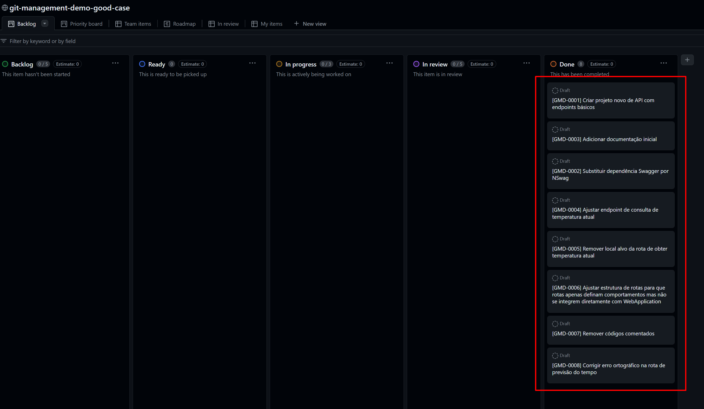
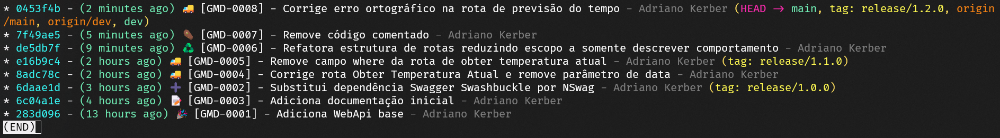

# git-management-demo
Demonstração de gerenciamento de repositório comparando dois casos, um positivo e um negativo.

Abaixo iremos descrever com detalhes ambos os casos, eles demonstram o dia a dia de um time onde um deles tem a política de rastreio de mudanças bem definida e focado na baixa carga cognitiva, sendo o outro orientado ao caos onde os commits não representam muita coisa e o histórico mais atrapalha do que ajuda quando há algum problema.

Sinta-se a vontade para analisar ambos os casos e tirar suas próprias conclusões. Estes modelos são baseados em experiências passadas em ambiente de trabalho, ambos os casos representam cenário vivenciados e de forma geral são divisores de águas entre um time mais iniciante e um time de alta performance.

----------------------------

## 1. [CASO RUIM]
Exemplo RUIM de gestão de código no git.

### 1.1 Propósito

Este projeto demonstra um caso de má gestão de commits, onde não se segue uma padrão para as mensagens de commit e todo merge de uma branch de feature com uma branch de longa duração resulta em um merge sem fast-forward (Ex: `git merge feature/xyz --no-ff`).
Resultando em uma árvore de commits caótica onde é quase impossível identificar o que foi alterado em caso de necessidade de reversão de alterações.

De forma geral aqui usamos commits para pontos específicos de evolução porém sem relação clara com o quadro de tarefas.

### 1.2 Problema

Temos um quadro do time onde gerenciamos as atividades no fluxo de trabalho, priorizações, etc.
Dado o quadro e histórico do git exibidos nas imagens abaixo o que você entende?

Quadro do time:


Histórico do Git:


Elaborando um pouco mais:

Neste exemplo utilizamos parte da essencia do git-flow, onde temos duas branches de longa duração `main` e `dev`, sendo a _main_ a branch que representa o código em ambiente de produção.
Também atrelado a _main_ temos `tags` onde cada tag representa uma release publicada em produção.
Também é importante destacar que como estratégia de unificação de branches utilizamos o `git merge <alvo> --no-ff` para forçar a criação de commits de merge.

Desta forma na imagem que exibe o histórico do git temos um emaranhado de commits com mensagens de pouco signnificado e branches bifurcando e se unindo novamente criando um histórico caótico.
> 💡Importante: o exemplo acima nem de longe representa um caso extremo do uso desta prática, porém serve ao propósito da demonstração.

### 1.3 Questionamentos

Olhando novamente as imagens acima:
- Você conseguiria relacionar facilmente os 4 itens de trabalho do quadro com os commits do histórico?
- Se você se esforçar um pouco mais, consegue fazer a relação?
- Hiiii, deu problema em produção, como identificar qual feature deu problema olhando esse histórico? Para revertê-la poderíamos reverter só um commit?

A resposta é: "Com tempo infinito tudo é possível", porém sabemos que nosso tempo é finito, logo trabalhar com esse padrão caótico não é viável, pois requer uma carga cognitiva extrema.

### 1.4 Conclusão

Pode-se perceber que este tipo de estratégia de gerenciamento de commits não deixa clara a relação entre o quadro de gestão de tarefas, além de dificultar a reversão de alterações pois necessitamos de uma composição de commits para entregar uma funcionalidade e talvez seja necessário reverter vários em caso de problema.

#### 1.4.1 Pontos negativos do modelo:

- (-) Alta carga cognitiva
- (-) Baixo rastreio de demandas
- (-) Propósito de alterações ofuscado
- (+) Commit rápido, sem gastar tempo refinando a mensagem de commit

---
---
---

## 2. [CASO BOM]
Exemplo BOM de gestão de código no git


### 2.1 Propósito

Este projeto demonstra um caso de boa gestão de commits, onde se segue uma padrão claro para as mensagens de commit e todo merge de uma branch de feature com uma branch de longa duração resulta é aplicado através de `git rebase` e utilizando squash para consolidar as features em estado final antes de jogar para as branches de longa duração.
Resultando em uma árvore de commits clara onde fica fácil identificar o que foi alterado em caso de necessidade de reversão de alterações.

De forma geral aqui usamos commits para pontos específicos de evolução com uma relação clara com o quadro de tarefas.

### 2.2 Problema

Temos um quadro do time onde gerenciamos as atividades no fluxo de trabalho, priorizações, etc.
Dado o quadro e histórico do git exibidos nas imagens abaixo o que você entende?

Quadro do time:


Histórico do Git:


Elaborando um pouco mais:

Neste exemplo utilizamos parte da essencia do git-flow, onde temos duas branches de longa duração `main` e `dev`, sendo a _main_ a branch que representa o código em ambiente de produção.
Também atrelado a _main_ temos `tags` onde cada tag representa uma release publicada em produção.
Além disso é importante destacar que como estratégia de unificação de branches utilizamos o `git rebase` e aplicamos `squash` para garantir uma boa visualização e centralização de alterações dependentes.

Com isso o resultado é um histórico linear e coeso. Mas além da estratégia acima foi necessário aplicar um padrão de mensagens de commit para amarrar os commits ao quadro do time.

#### 2.2.1 Padrão de Commits

O padrão aplicado é simples, segue template:
```c#
var template = $"{_gitmoji} [{_featureId}] #{_taskId} - {_mensagemDeAcao}";

// Exemplo:
var exemploMensagemRenderizada = "🧵 [US-1234] #TK-1248 - Adiciona multi-threads para fluxo de processamento do KafkaConsumer";
```
> 💡Importante: o segundo campo de identificação do padrão é opcional. Como podem ver na imagens acima, nosso board de exemplo possui apenas um nível de tarefas, não tendo tarefas filhas, desta forma o segundo campo do padrão `#taskId` foi omitido por completo nas mensagens.

Conforme ilustrado acima o padrão é simples, composto por 4 partes:
- `Gitmoji`: Inicia com um emoji que deve traduzir o propósito principal do commit cujo segue o padrão proposto pelo guia do [Gitmoji](https://gitmoji.dev/).
- `FeatureId`: O identificador da feature que será entregue, esse identificador deve ser o mesmo do quadro de tarefas do time, para que permita o rastreio entre os commits e o quadro. OBS: este id normalmente representa uma User Story quando estamos falando de uma gerenciamento mais complexo de quadros de time.
- (Opcional) `TaskId`: O identificador da tarefa que o dev está tocando quando a feature é grande e faz sentido entregar pequenas partes, seja para garantir um bom fluxo de revisão de **Pull Requests** ou apenas paralelizar o trabalho entre mais devs.

Desta forma na imagem que exibe o histórico do git temos uma visão direcionada sobre o propósito de cada commit além de detalhes na mensagem para garantir o rastreio de cada commit de volta ao quadro do time.

### 2.3 Questionamentos

Olhando novamente as imagens acima:
- Você conseguiria relacionar facilmente os itens de trabalho do quadro com os commits do histórico?
- Hiiii, deu problema em produção, como identificar qual feature deu problema olhando esse histórico? Podemos revertê-la facilmente?

Acreditamos que sim, com este padrão de commits e um uso controlado de `git rebase` conseguimos construir um fluxo linear e coeso garantindo uma fácil gestão.

### 2.4 Conclusão

Conforme já dito acima, com este padrão de commits e um uso controlado de `git rebase` conseguimos construir um fluxo linear e coeso garantindo uma fácil gestão.

#### 2.4.1 Prós e contras

- (+) Baixa carga cognitiva para rastreio de problemas
- (+) Rastreio de demandas claro
- (+) Propósito de alterações claro
- (-) Tempo na criação de mensagem de commit mais alto

Referências:
- [Quadro do time](https://github.com/users/adrianokerber/projects/4/views/1)

## 3. TL; TR;

Foram apresentados dois casos de gerenciamento de repositório e rastreio de demandas onde se provou que um bom gerenciamento requer padronização estruturada. 

Repositórios dos estudos de caso:
- [Caso Ruim](https://github.com/adrianokerber/git-management-demo-bad-case)
- [Caso Bom](https://github.com/adrianokerber/git-management-demo-good-case)